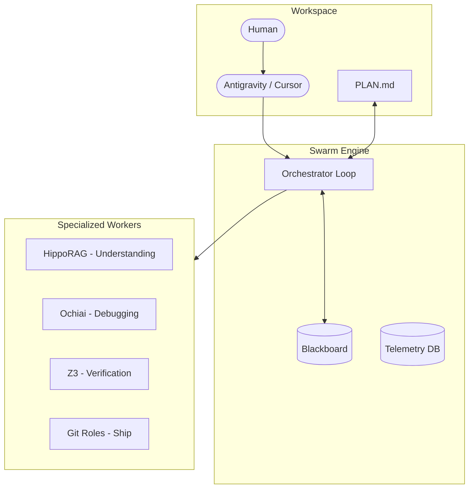

  

  ### Build faster with Swarm

  
  
  
  

---

## 🚀 The Vision

**Swarm** is a high-performance squad of specialized AI agents that live inside your IDE. It uses algorithms to find bugs, audit your Git flow, and verify logic before you even hit save. It handles the grunt work so you can focus on building software.

### Origins & Inspiration

Swarm was born from the realization that while LLMs are powerful, they lack the deterministic rigor required for professional software engineering. Inspired by the orchestration patterns of OpenAI's original Swarm research, we've evolved those concepts into a production-ready workforce that combines:
- **Algorithmic Precision**: AST analysis, formal verification, and statistical debugging.
- **Autonomous Workflows**: Self-driven Git management and task synchronization.
- **Stateful Memory**: Context that survives across sessions and agents.

---

## 📺 See it in action
 
Watch Swarm autonomously analyze a project and sync its brain with the codebase in real-time.
 

  <iframe src="https://player.vimeo.com/video/1158005784" width="800" height="450" frameborder="0" allow="autoplay; fullscreen; picture-in-picture" allowfullscreen></iframe>

---

## 🏗️ Core Architecture

Swarm operates as a centralized **Orchestrator** that coordinates a decentralized squad of **Algorithmic Workers**.

---

## 🧠 The Three Pillars

1.  **Algorithmic Core**: We use deterministic algorithms (HippoRAG, Ochiai SBFL, Z3) to ensure that agent actions are grounded in codebase reality, not just probabilistic guesses.
2.  **Autonomous Workforce**: Specialized Git roles (Auditor, Scout, Triage) handle mundane project management and code quality tasks autonomously.
3.  **Active Governance**: Every action is audited via a Telemetry system. Self-healing loops detect and mitigate repeated failures automatically.

---

## 🤖 Specialized Workforce

Swarm assigns roles based on the task at hand. You can trigger them directly in your `PLAN.md` using flags.

| Role | Trigger Flag | Responsibility |
| :--- | :--- | :--- |
| **Feature Scout** | `feature_discovery=True` | Scans TODOs, proposes new features, and creates issues. |
| **Code Auditor** | `code_audit=True` | Performs security reviews and ensures adherence to style guides. |
| **Issue Triage** | `issue_triage_needed=True` | Analyzes backlog, suggests priorities, and applies labels. |
| **Branch Manager** | `git_create_pr=True` | Handles PR creation, merge conflicts, and branch hygiene. |

---

## ⚡ Get Moving

Getting set up takes less time than a coffee break.

1.  **[Lock In](./getting-started/installation.md)** — Grab the Docker image and get running.
2.  **[First Ship](./getting-started/quickstart.md)** — Run your first autonomous task and see the magic.
3.  **[Sync Your Editor](./getting-started/installation.md#ide-configuration)** — Support for Antigravity, Cursor, and Claude Desktop.

---

## 📖 The Deep Dive

Everything you need to master the workforce:

| Quick Start | The Vibe | Playbook | Reference |
|-----------------|----------|--------|-----------|
| [Intro Guide](getting-started/introduction.md) | [How it Works](concepts/architecture.md) | [Using PLAN.md](guides/plan-syntax.md) | [Tools List](reference/tools.md) |
| [Setup](getting-started/installation.md) | [Agent Logic](concepts/decision-logic.md) | [Git Workflow](guides/git-workflows.md) | [Config Settings](reference/configuration.md) |
| [First Mission](getting-started/quickstart.md) | [The 3 Pillars](concepts/three-pillars.md) | [Expert Debugging](guides/debugging.md) | [API Specs](reference/api.md) |
| | | [Custom Tools](guides/custom-tools.md) | [FAQ](reference/troubleshooting.md) |

---

## 🤝 Build with Us

Check out the [Contributor Guide](CONTRIBUTING.md).

---

## 📜 License

Swarm is MIT Licensed. Build something cool.
